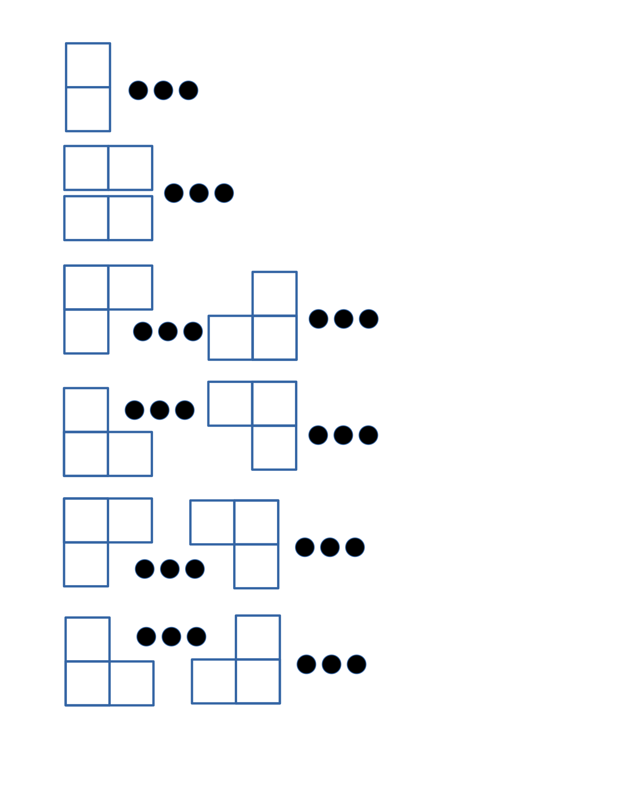

# Domino and Tromino Tiling
A bit of mathematical analysis of one tiling problem on leetcode. 

There is  a problem on [leetcode] (https://leetcode.com/problems/domino-and-tromino-tiling/) .

You have two types of tiles: dominoes (1x2) and trominoes (2x2 without one corner). 

It is required to write a program to calculate the number of ways to tile a 2xn rectangle. 

## Solution
It is easy to show that a tilling can only start in one of the following ways:

The space between trominoes can only be tiled in one way.

Hence we can write a recurrent relation for the number of ways to tile a 2xn rectangle.

